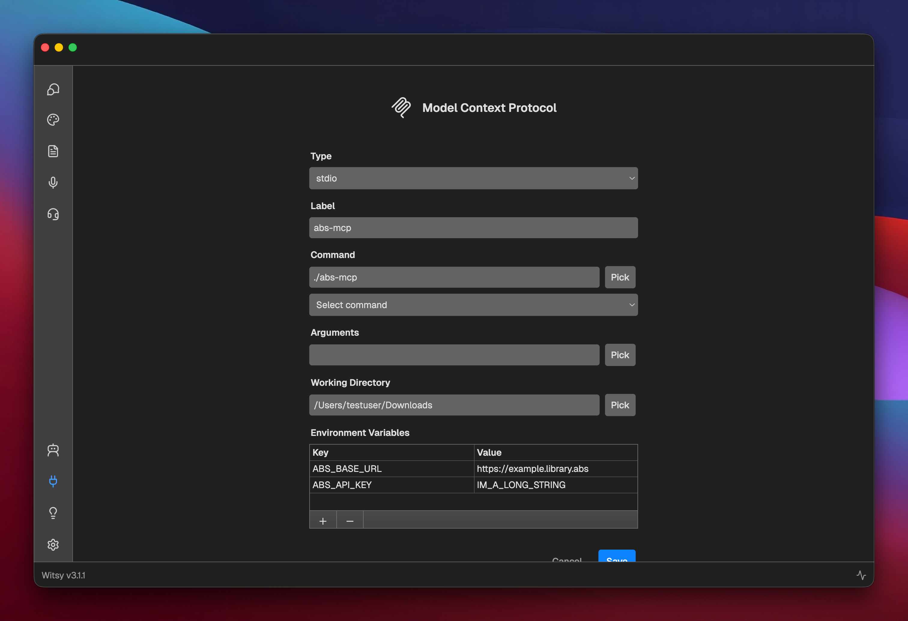

# Audiobookshelf MCP Server

A Model Context Protocol (MCP) server that provides tools to interact with your [Audiobookshelf](https://www.audiobookshelf.org/) instance. Access your libraries, audiobooks, podcasts, authors, collections, and playlists through AI assistants that support MCP.

## Disclaimer

**USE AT YOUR OWN RISK:** This software is provided "as is" without warranty of any kind. The author is not responsible for any misuse, accidents, data loss, or any other issues that may arise from using this software. Users are solely responsible for ensuring proper configuration and usage of this tool with their Audiobookshelf instance.

---

## Features

- List and retrieve libraries with optional sub-resources (items, authors)
- Get individual items (audiobooks or podcasts)
- Browse authors and their works
- Access collections and playlists
- Retrieve user information

## Installation

### Prerequisites

- An Audiobookshelf instance with API access
- An API token from your Audiobookshelf instance

### Recommended: Download Pre-built Release

**The easiest way to install is to download a pre-built binary from the [latest release](https://github.com/your-username/abs-mcp/releases/latest).**

| Platform | Architecture | Filename |
|----------|-------------|----------|
| macOS | Intel (x86_64) | `audiobookshelf-mcp_VERSION_darwin_amd64.tar.gz` |
| macOS | Apple Silicon (ARM64) | `audiobookshelf-mcp_VERSION_darwin_arm64.tar.gz` |
| Linux | 64-bit (x86_64) | `audiobookshelf-mcp_VERSION_linux_amd64.tar.gz` |
| Linux | ARM64 | `audiobookshelf-mcp_VERSION_linux_arm64.tar.gz` |
| Linux | 32-bit (x86) | `audiobookshelf-mcp_VERSION_linux_386.tar.gz` |
| Windows | 64-bit (x86_64) | `audiobookshelf-mcp_VERSION_windows_amd64.tar.gz` |
| Windows | ARM64 | `audiobookshelf-mcp_VERSION_windows_arm64.tar.gz` |
| Windows | 32-bit (x86) | `audiobookshelf-mcp_VERSION_windows_386.tar.gz` |

**Installation steps:**

1. Download the appropriate archive for your platform from the releases page
2. Extract the archive:
   ```bash
   tar -xzf audiobookshelf-mcp_VERSION_PLATFORM.tar.gz
   ```
3. Move the binary to a location in your PATH (optional but recommended):
   ```bash
   # macOS/Linux
   sudo mv abs-mcp /usr/local/bin/

   # Or to a user directory
   mv abs-mcp ~/.local/bin/
   ```
4. Make it executable (macOS/Linux):
   ```bash
   chmod +x /usr/local/bin/abs-mcp
   ```

### Alternative: Build from Source

If you prefer to build from source:

**Prerequisites:**
- Go 1.21 or later

```bash
git clone <repository-url>
cd abs-mcp
go build
```

## Configuration

The MCP server requires two pieces of configuration:

1. **ABS_BASE_URL** - The base URL of your Audiobookshelf instance (e.g., `https://abs.example.com`)
2. **ABS_API_KEY** - Your Audiobookshelf API token

### Getting Your API Token

1. Log into your Audiobookshelf instance
2. Go to Settings → Users → Your User
3. Click "Generate API Token" or copy your existing token

## Usage

### Environment Variables

You can set the configuration using environment variables:

```bash
export ABS_BASE_URL="https://abs.example.com"
export ABS_API_KEY="your-api-token-here"
```

Alternatively, you can pass these as parameters when calling tools (see Tool Parameters below).

### Setting Up with Witsy

[Witsy](https://github.com/nbonamy/witsy) is a desktop AI assistant that supports MCP servers. Here's how to set it up:

1. Open Witsy and go to Settings (⚙️ icon)
2. Navigate to the MCP section
3. Add a new server with the following configuration:



**Configuration details:**
- **Type**: `stdio`
- **Label**: `abs-mcp` (or any name you prefer)
- **Command**: `/path/to/abs-mcp` (use the "Pick" button to select your compiled binary)
- **Arguments**: (leave empty)
- **Working Directory**: Any directory (e.g., `/Users/yourname/Downloads`)
- **Environment Variables**:
  - `ABS_BASE_URL` = `https://example.library.abs` (your Audiobookshelf URL)
  - `ABS_API_KEY` = `IM_A_LONG_STRING` (your API token)

4. Click "Save" to add the server
5. The server will now be available in your Witsy conversations!

### Setting Up with Claude Desktop

Add this to your Claude Desktop configuration file:

**macOS**: `~/Library/Application Support/Claude/claude_desktop_config.json`
**Windows**: `%APPDATA%\Claude\claude_desktop_config.json`

```json
{
  "mcpServers": {
    "audiobookshelf": {
      "command": "/path/to/abs-mcp",
      "env": {
        "ABS_BASE_URL": "https://abs.example.com",
        "ABS_API_KEY": "your-api-token-here"
      }
    }
  }
}
```

## Available Tools

### Libraries

- **libraries** - List all libraries
- **library** - Get a single library by ID, or fetch specific library sub-resources:
  - `items=true` - Get all items in the library
  - `authors=true` - Get all authors in the library
  - `series=true` - Get all series in the library
  - `collections=true` - Get all collections in the library
  - `playlists=true` - Get all playlists in the library
  - `personalized=true` - Get personalized view for the library
  - `filterdata=true` - Get filter data for the library
  - `stats=true` - Get library statistics
  - `episode-downloads=true` - Get episode downloads for the library
  - `recent-episodes=true` - Get recent episodes for the library
- **create_library** - Create a new library
  - Required: `name`, `folders` (comma-separated paths), `media_type` (book or podcast)
  - Optional: `icon`, `provider`

### Items

- **item** - Get a single item (audiobook or podcast) by ID, or fetch specific item sub-resources:
  - `cover=true` - Get the cover image for the item
  - `tone-object=true` - Get the tone object for the item

### Authors

- **author** - Get a single author by ID

### Collections

- **collections** - List all collections
- **collection** - Get a single collection by ID
- **create_collection** - Create a new collection
  - Required: `library_id`, `name`
  - Optional: `description`
- **add_to_collection** - Add a book to an existing collection
  - Required: `collection_id`, `book_id`

### Playlists

- **playlists** - List all playlists
- **playlist** - Get a single playlist by ID
- **create_playlist** - Create a new playlist
  - Required: `library_id`, `name`
  - Optional: `description`
- **add_to_playlist** - Add an item to an existing playlist
  - Required: `playlist_id`, `item_id`
  - Optional: `episode_id` (for podcast episodes)

### User

- **me** - Get authenticated user information, or fetch specific user sub-resources:
  - `listening-sessions=true` - Get listening sessions for the user
  - `listening-stats=true` - Get listening statistics for the user
  - `items-in-progress=true` - Get items currently in progress for the user
  - `progress_item_id=<id>` - Get progress for a specific library item
  - `progress_item_id=<id>` + `progress_episode_id=<id>` - Get progress for a specific episode

### Sessions

- **sessions** - List all playback sessions
- **session** - Get a single playback session by ID

### Podcasts

- **podcasts** - List all podcasts, or fetch podcast-related resources:
  - `feed=true` - Get podcast RSS feed
  - `opml=true` - Get podcast OPML export
- **podcast** - Get a single podcast by ID, or fetch podcast sub-resources:
  - `downloads=true` - Get downloads for the podcast
  - `search-episode=true` - Search for episodes in the podcast
  - `episode_id=<id>` - Get a specific episode by ID
- **check_podcast_episodes** - Check for new episodes for a podcast
  - Required: `podcast_id`

### Progress Tracking

- **update_progress** - Update listening progress for a media item
  - Required: `item_id`, `progress` (in seconds)
  - Optional: `duration` (in seconds), `is_finished` (boolean), `episode_id` (for podcasts)

### Backups

- **create_backup** - Create a server backup

## Tool Parameters

All tools accept optional `base_url` and `token` parameters that override the environment variables:

```json
{
  "base_url": "https://abs.example.com",
  "token": "your-api-token-here"
}
```

This is useful if you need to access multiple Audiobookshelf instances or prefer not to use environment variables.

## Example Queries

Once configured, you can ask your AI assistant questions like:

**Reading and browsing:**
- "Show me all my audiobook libraries"
- "What items are in my Fiction library?"
- "Get details about the author with ID abc123"
- "List all my playlists"
- "What's in my Currently Reading collection?"

**Creating and managing:**
- "Create a new collection called 'Summer Reads' in my library"
- "Add this book to my 'Currently Reading' collection"
- "Create a new playlist for my favorite sci-fi audiobooks"
- "Check for new podcast episodes"
- "Update my progress to 45 minutes on this audiobook"
- "Create a backup of my server"

The AI assistant will use the appropriate MCP tools to fetch information and manage your Audiobookshelf instance.

## Development

### Project Structure

- `main.go` - Main server implementation
- Helper functions for API authentication and request handling
- MCP tool definitions and handlers

### Adding New Tools

To add a new tool:

1. Define the tool options using `mcp.NewTool()`
2. Add authentication parameters with `withABSAuth()`
3. Register the tool with `s.AddTool()`
4. Use helper functions like `createSimpleGETHandler()` or `createGETByIDHandler()`

## License

GNU General Public

## Contributing

Contributions are welcome! Please open an issue or submit a pull request.

## Support

For issues related to:
- This MCP server: Open an issue in this repository
- Audiobookshelf: Visit [audiobookshelf.org](https://www.audiobookshelf.org/)
- MCP Protocol: See [modelcontextprotocol.io](https://modelcontextprotocol.io/)
